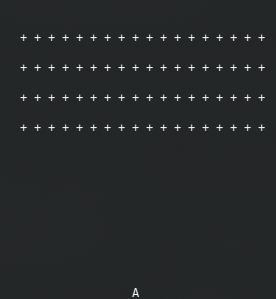

<h1 align="center">
  👾 Invaders <hr />
  
</h1>

### The classic space-shooter game now in your terminal! And the good part: made in Rust!

❕ This game was made during the course `Ultimate Rust`, as an exercise.

---
## How to play it

[Download the game on the releases page](https://github.com/joojscript/invaders/releases/tag/v1.0), then just run the game on your terminal like this:

```console
user@pc:~$ ./invaders
 * The game will start on your terminal *
```